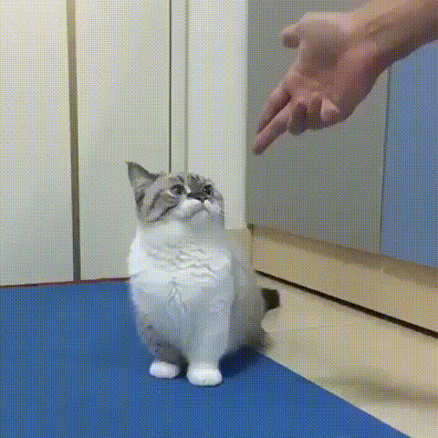

# Club of Munchkins
This site is a fake/made-up club revolved around the Munchkin Cat breed, the site consists of a home page, a web page explaining the site and what it's about, and a web page listing 3 articles of interest with a table.

## GitHub Live URL
[Club of Munchkins](https://shetookthemolly.github.io/cosc219-site)

### What I Found Difficult
In the first lab, I found only just brainstorming an idea for a site to be the most difficult part. I found myself changing the site's theme a lot. I also found using elements properly like emphasize and strong or elements that group content to be difficult to understand at first, but I believe I began to understand those concepts better now.

#### AI-Use
In the first lab, I primarily used chat bots to brainstorm an idea for the table in *projects.html*, as I struggled to come up with a idea for that. Aside from that, it was mainly just to help understand some elements that i was confused about. In the second lab, I used chat bots to help better understand certain styles and selectors and to understand how to use them better, I also used chat bots to understand a specific error I was getting in contact.html, which was using field sets inside a paragraph element.

##### 09/29/26 Update (Lab 2)
In the second lab, I created a page with a form for providing contact information. I applied a lot of styling to all pages, and changed a few images. One styling decision I made was navigation links being highlighted when you hover your cursor over them. The reason I did this was to make the navigation footer on each page standout more. I quite enjoyed how the styling turned out on each page, but I still have more ideas for the next lab that will make each web page look even better.
